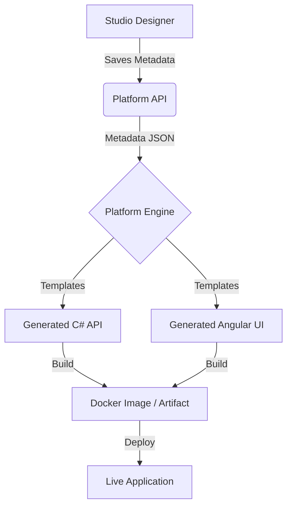

# Professional App Design & Deployment Lifecycle Guide

This document provides a comprehensive, step-by-step walkthrough of how to design, build, and deploy an application using **DynamicPlatform**.

---

## 1. Overview
DynamicPlatform is a "Metadata-First" low-code platform. You don't write the application code manually; instead, you define the "Blueprint" (Metadata) in the **Platform Studio**, and the **Platform Engine** transpiles that blueprint into a fully functional .NET 9 + Angular application.

---

## 2. Step 1: Designing Your App (In Platform Studio)

### 2.1. Create a Project
Every app starts as a **Project**. A project acts as a container for all your entities, logic, and UI definitions.
- Go to the **Projects List** and click "New Project".
- Provide a name (e.g., "Inventory Management System").

### 2.2. Entity Modeling (The Data Layer)
Entities are the building blocks of your app (equivalent to Database Tables).
1.  **Define Fields**: Add properties like `Name` (String), `Price` (Decimal), `Quantity` (Integer), etc.
2.  **Validation Rules**: Set constraints (Required, Max Length, Range).
3.  **Relationships**:
    - **One-to-Many**: e.g., A `Category` has many `Products`.
    - **Many-to-Many**: e.g., A `Product` can belong to multiple `Tags`, and a `Tag` can be on multiple `Products`.
    - *The platform automatically generates the join entities for you.*

### 2.3. Visual UI Design
Using the **Canvas/Visual Builder**:
- Drag and drop components onto the workspace.
- Map UI components to Entity fields (e.g., a Text Input mapped to `Product.Name`).
- Define interactions (e.g., "On Button Click" -> "Save Entity").

---

## 3. Step 2: The Generation Process (The "Magic")

Once your design is ready, you trigger a **Build**. The platform follows these steps internally:

1.  **Metadata Extraction**: The Studio sends the JSON definition of your project to the `Platform.API`.
2.  **Engine Processing**:
    - The `Platform.Engine` receives the JSON.
    - It iterates through **Scriban Templates** (.sbn files).
    - It generates C# files for the Backend (Controllers, Repositories, DbContext).
    - It generates TypeScript/HTML files for the Frontend (Angular Services, Components).
3.  **The "Generation Gap"**:
    - Code is generated as `partial classes`.
    - If you need custom logic, you can write it in a separate file that won't be overwritten when you rebuild the project.

---

## 4. Step 3: Deployment Options

### 4.1. Option A: Local Development (Manual)
Best for testing during design.
1.  Navigate to the generated code directory.
2.  Run `dotnet run` for the backend.
3.  Run `npm start` for the frontend.

### 4.2. Option B: Dockerized Deployment (Production-Ready)
This is the recommended way to run the entire stack (Platform + Database) reliably.

#### **The Stack Components:**
- **PostgreSQL**: Stores the platform metadata and the generated app data in isolated databases.
- **Platform API**: The orchestration service that automatically provisions unique connection strings for each project.
- **Platform Studio**: The web-based designer.

#### **How Isolation is Enforced:**
1.  **Unique Data Store**: Every project created in the Studio is assigned a unique `TargetDbName` (e.g., `app_inventory_8123ab`).
2.  **Dedicated Connection Strings**: The Platform API generates a project-specific connection string during project creation.
3.  **Build Inclusion**: When you trigger a **Build**, the platform automatically generates an `appsettings.json` file inside your build artifact containing your project's isolated connection string.
4.  **Schema Separation**: This ensures that even if multiple apps run on the same PostgreSQL server, they cannot access each other's data as they operate on completely different databases.

#### **Deployment Steps:**
1.  **Prerequisites**: Ensure Docker and Docker Compose are installed.
2.  **Start the Services**:
    ```bash
    docker-compose up --build -d
    ```
3.  **Access the Platform**:
    - Open `http://localhost:4200` to start designing.
    - The database is persisted automatically in a Docker volume.

---

## 5. Step 4: Accessing the Generated App

After the engine completes the build, it provides an **Artifact** (usually a ZIP file or a folder).
- **Static Hosting**: The Angular frontend can be hosted on Nginx, Azure Static Web Apps, or AWS S3.
- **API Hosting**: The .NET API can run in any Docker container or Azure App Service.

---

## 6. Summary Flowchart


---

## 7. Developer Tips
- **AI Copilot**: Use the built-in Gemini integration to describe your app in natural language (e.g., "Build me a CRM with Customers and Invoices"), and it will scaffold the entities for you.
- **Extensibility**: Always check the `Docs/guidance` folder if you need to add custom templates to the Engine.
