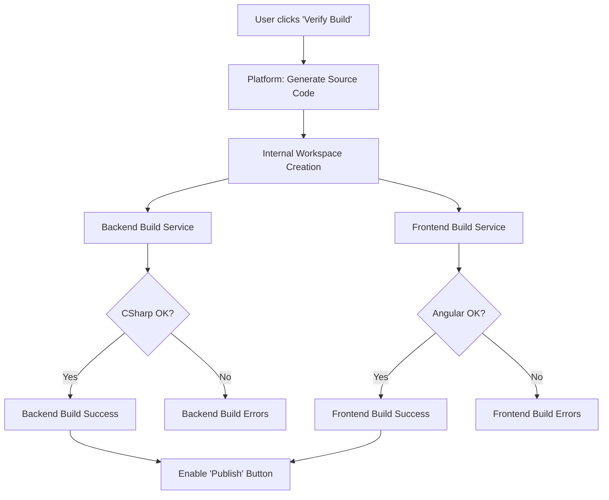

# Technical Design: Full-Stack Build Verification

This document details the technical implementation for a one-click build verification process that validates both Backend (C#) and Frontend (Angular) code generated by DynamicPlatform.

## 1. Objective
Provide users with a way to verify that their low-code metadata (entities, flows, UI) results in a technically sound and compilable application before they commit to exporting or publishing.

## 2. Process Flow

---

## 3. Backend Build Verification (C#)
*   **Target**: The generated ASP.NET Core solution.
*   **Command**: `dotnet build`
*   **Requirements**:
    *   A containerized environment with the .NET 9.0 SDK.
    *   Access to the platform's shared NuGet packages.
*   **Error Parsing**: Capture the `stdErr` and map line numbers back to the metadata definitions (e.g., mapping a C# syntax error in a property back to the Entity Designer field).

---

## 4. Client-Side Build Verification (Angular)
*   **Target**: The generated Angular CLI project.
*   **Command**: `npm install && npm run build -- --configuration production`
*   **Requirements**:
    *   Base Angular template files (package.json, angular.json, tsconfig) must be present in the generator templates.
    *   A runner environment with Node.js and the Angular CLI.
*   **Verification Steps**:
    1.  **Template Injection**: Inject generated components into the `app.routes.ts` and `app.component.ts`.
    2.  **Linting**: Run `ng lint` to catch common code-smell or type errors.
    3.  **Compilation Check**: Run `ng build` to ensure all Type annotations and template bindings are correct.

---

## 5. Metadata Mapping (Crucial for UX)
A build error like `CS0103: The name 'X' does not exist in current context` is useless to a low-code user. The platform must:
*   Identify the file: `Entities/Doctor.cs`
*   Identify the field: `Specialization`
*   Highlight the error in the **Visual Designer** interface.

---

## 6. Infrastructure Recommendation
*   **Worker Nodes**: Separate ephemeral containers (Docker/Kubernetes) to run builds without impacting the Platform API's performance.
*   **Caching**: Persistent cache for `node_modules` and `bin/obj` folders to speed up subsequent "incremental" build verifications.
