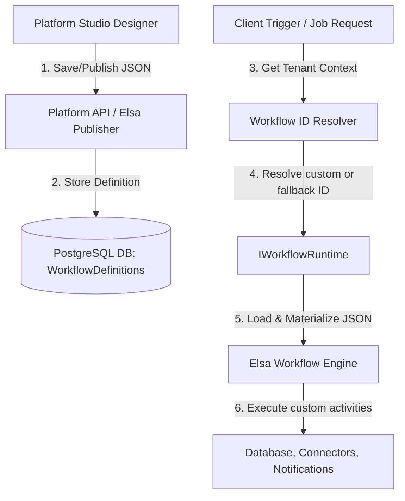
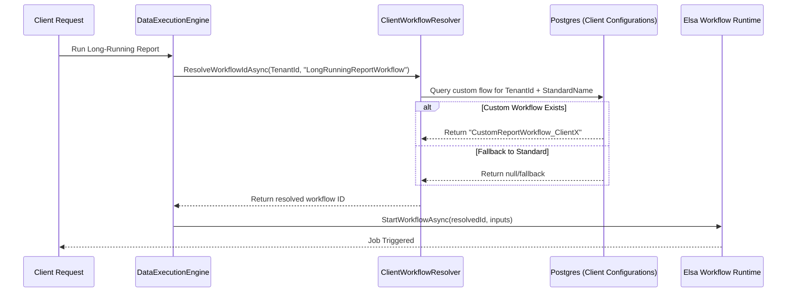

# 📐 Elsa 3 JSON-Based Workflow Designer & Execution Architecture

This document outlines how workflows designed visually as JSON in the **Platform Studio Designer** are stored, registered, and executed in **DynamicPlatform**, specifically detailing how to support **client-specific alternative workflows** instead of hardcoded C# implementations.

---

## 1. High-Level Architecture & Lifecycle



### 1.1. Designer to Database (Metadata Layer)
When a user designs a workflow in the frontend:
1. The **Platform Studio Designer** serializes the visual layout into a standardized **Elsa 3 JSON schema**.
2. This schema defines variables, metadata, inputs/outputs, triggers, and the structured sequence of activities.
3. The JSON is sent via the API and stored in the database:
   * **Elsa's Internal Store**: Managed by Elsa's `WorkflowDefinitions` table.
   * **Platform Core Store**: Wrapped inside a DynamicPlatform `Artifact` entity with `Type: Workflow` for version control and multi-tenant isolation.

---

## 2. How the JSON Workflow is Executed

Elsa 3 loads, materializes, and executes JSON-based workflows through three main paradigms:

### A. Programmatic Execution (`IWorkflowRuntime`)
When an operation (like a long-running report job) starts programmatically:
```csharp
// 1. Resolve workflow execution parameters
var workflowInput = new Dictionary<string, object> { ["JobId"] = jobId, ["UserId"] = userId };

// 2. Start execution via the runtime by specifying the definition ID
var result = await _workflowRuntime.StartWorkflowAsync(
    "ClientSpecificReportWorkflow_ClientA", // Dynamically resolved definition ID
    new StartWorkflowRuntimeParams
    {
        Input = workflowInput
    });
```
* **Engine Action**: The `WorkflowRuntime` queries the active `WorkflowDefinition` matching the provided ID from the database, builds an in-memory execution graph from the JSON, injects the input variables, and triggers execution.

### B. Event-Based / Triggered Execution
Workflows containing triggers (such as `HttpTrigger` or `CronTrigger`) are automatically indexed by Elsa:
1. On application startup or when a new workflow is published, Elsa's `IWorkflowScheduler` / `IWorkflowTriggerIndexer` registers active triggers.
2. When an external HTTP request hits `/workflows/{trigger_path}` or a Cron timer ticks, Elsa matches the request/event to the stored JSON definition and instantiates a new workflow runner automatically.

---

## 3. Implementing Client-Specific Alternative Flows

In a multi-tenant environment, clients often require deviations from standard business logic. Rather than overriding code templates, we leverage Elsa's dynamic nature to support alternative workflows.

### 🏛️ Strategy A: Dynamic Workflow Resolver (Recommended)
Introduce a resolution layer that determines the workflow definition ID to run based on the client context (e.g. `TenantId`).



#### Code Implementation Pattern
1. **Define the Database Configuration Model**:
   ```csharp
   public class ClientWorkflowConfig
   {
       public Guid Id { get; set; }
       public string TenantId { get; set; } = null!;
       public string StandardWorkflowName { get; set; } = null!;
       public string CustomWorkflowDefinitionId { get; set; } = null!;
       public bool IsActive { get; set; } = true;
   }
   ```

2. **Implement the Resolver Service**:
   ```csharp
   public interface IClientWorkflowResolver
   {
       Task<string> ResolveWorkflowIdAsync(string tenantId, string standardWorkflowName);
   }

   public class ClientWorkflowResolver : IClientWorkflowResolver
   {
       private readonly DbContext _dbContext;

       public ClientWorkflowResolver(DbContext dbContext)
       {
           _dbContext = dbContext;
       }

       public async Task<string> ResolveWorkflowIdAsync(string tenantId, string standardWorkflowName)
       {
           var config = await _dbContext.Set<ClientWorkflowConfig>()
               .FirstOrDefaultAsync(c => c.TenantId == tenantId 
                                      && c.StandardWorkflowName == standardWorkflowName 
                                      && c.IsActive);

           // Fallback to standard hardcoded name if no override exists
           return config?.CustomWorkflowDefinitionId ?? standardWorkflowName;
       }
   }
   ```

3. **Refactor the Invoker (`DataExecutionEngine.cs`)**:
   ```diff
   - var result = await _workflowRuntime.StartWorkflowAsync(
   -     "LongRunningReportWorkflow",
   -     new StartWorkflowRuntimeParams
   -     {
   -         Input = workflowInput
   -     });
   + var resolvedWorkflowId = await _workflowResolver.ResolveWorkflowIdAsync(
   +     context.TenantId, 
   +     "LongRunningReportWorkflow"
   + );
   +
   + var result = await _workflowRuntime.StartWorkflowAsync(
   +     resolvedWorkflowId,
   +     new StartWorkflowRuntimeParams
   +     {
   +         Input = workflowInput
   +     });
   ```

---

### 🔀 Strategy B: Inner-Workflow Conditional Branching
For minor variations, keep a single JSON workflow but embed conditional nodes:

1. Pass the `TenantId` in the input dictionary payload.
2. In the Elsa Designer, drag an **`If`** or **`Switch`** activity.
3. Write an expression (C# or JavaScript in the designer) matching the client ID:
   ```javascript
   // JavaScript trigger expression
   context.GetWorkflowInput("Context").TenantId == "Client_A"
   ```
4. Route specific branches to client-tailored tasks, leaving the main ingestion pipeline untouched.
