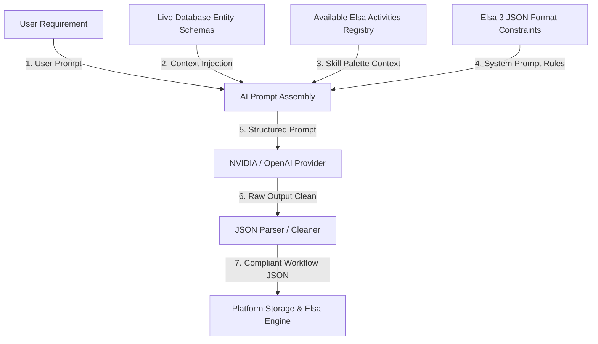

# 🤖 AI-Driven Workflow JSON Generation Design

This document details how **DynamicPlatform** can integrate external AI models (via NVIDIA, OpenAI, or Groq) to convert natural language business processes into executable **Elsa 3.x and Custom Studio Workflow JSON definitions**.

---

## 1. High-Level AI Context Flow



To generate valid workflows, the AI engine must blend four core ingredients:
1. **The User Prompt**: The business workflow requirement (what to automate).
2. **Schema Context**: Live database entities and fields, ensuring the workflow references actual data properties.
3. **Activity/Connector Registry**: The custom and built-in activities available in the platform's DI container (e.g., email notification parameters, database query parameters).
4. **Elsa 3 JSON Schemas**: Syntactical rules defining nesting, connections, variables, and triggers.

---

## 2. Target JSON Output Formats

We support **two target schemas** for workflow JSON generation:

### Format A: The Platform Studio Simplified Canvas JSON
Ideal if the user wants to further edit the workflow inside the simplified Konva designer.
```json
{
  "name": "PascalCaseWorkflowName",
  "nodes": [
    {
      "id": "uniqueNodeId",
      "type": "http | db | logic | notify | attachment",
      "x": 150,
      "y": 200,
      "label": "User Friendly Label",
      "config": {
        "path": "/api/orders/new",
        "method": "POST",
        "query": "SELECT * FROM ...",
        "script": "return { success: true };",
        "channel": "email",
        "template": "Hello {name}..."
      }
    }
  ],
  "connections": [
    { "fromId": "nodeA", "toId": "nodeB" }
  ]
}
```

### Format B: The Official Elsa 3.x Engine Definition JSON
Ideal for direct deployment and execution, utilizing nested Activities and runtime variables natively.
```json
{
  "id": "ClientSpecificWorkflowId",
  "name": "ProcessOrderFlow",
  "root": {
    "type": "Elsa.Sequence",
    "id": "sequence-1",
    "activities": [
      {
        "type": "Elsa.HttpTrigger",
        "id": "http-trigger-1",
        "config": {
          "path": "/v1/orders",
          "method": "POST"
        }
      },
      {
        "type": "Platform.Engine.Workflows.Activities.ExecuteDataQueryActivity",
        "id": "db-query-1",
        "queryMetadata": {
          "queryText": "SELECT * FROM Customers WHERE Id = @Id"
        }
      }
    ]
  }
}
```

---

## 3. System Prompt Engineering

To guarantee reliable JSON outputs without runtime or syntax errors, the system prompt must act as a strict compiler boundary.

### Proposed System Prompt: `GenerateWorkflowSchema.md`

```markdown
You are a Senior Automation Architect specialized in Elsa 3.x Workflows. 
Your task is to convert the user's business automation description into a valid, parsable JSON workflow.

## 🏗️ SCHEMA OPTIONS
You can generate either a standard PLATFORM CANVAS JSON or a native ELSA 3.x ENGINE JSON.
*   By default, prioritize the native **ELSA 3.x ENGINE JSON** if the flow requires advanced nested logic, loops, or complex triggers.
*   Always output ONLY the raw JSON object. No Markdown code fences, no introductions, no explanations.

## 🧱 BUILT-IN ACTIVITY REGISTRY
Map the steps to these exact activities:
1.  **Elsa.HttpTrigger**: Initiates workflow on HTTP requests.
    *   `path` (string, e.g. "/webhooks/order")
    *   `method` (GET, POST, PUT, DELETE)
2.  **Platform.Engine.Workflows.Activities.ExecuteDataQueryActivity**: Queries database.
    *   `queryMetadata` (SQL text or structured metadata)
3.  **Platform.Engine.Workflows.Activities.GenerateReportOutputActivity**: Outputs reports.
    *   `outputFormat` (Excel, PDF, CSV, JSON)
4.  **Platform.Engine.Workflows.Activities.UploadToStorageActivity**: Saves files.
    *   `containerName` (string)
5.  **Platform.Engine.Workflows.Activities.NotifyUserActivity**: Alerts user.
    *   `userId` (guid), `status` (string), `reportTitle` (string)

## 📌 HARD RULES
1.  **Syntax Constraint**: Output must be 100% valid JSON matching the target schema.
2.  **Strict Typing**: Ensure parameters map precisely to target types.
3.  **Referential Integrity**: When referencing database entities or fields, verify they exist in the injected context schema.
```

---

## 4. Context Extraction Mechanics

To ensure the AI references actual entities and columns, we must inject live metadata. 

We can leverage the existing `SchemaContextExtractor.cs` inside [AiController.cs](file:///c:/Sudipto/Antigravity/DynamicPlatform/src/Platform.API/Controllers/AiController.cs#L368-L370).

### Schema Context Injected into Prompt:
```markdown
## AVAILABLE SYSTEM DATA ENTITIES
| Entity Name | Primary Keys | Accessible Fields & Types |
| :--- | :--- | :--- |
| Customer | Id (Guid) | Name (string), Email (string), Status (bool) |
| Order | Id (Guid) | CustomerId (Guid), TotalAmount (decimal) |

## CUSTOM SYSTEM CONNECTORS
*   **EmailSenderConnector**: Methods `SendEmailAsync(to, subject, body)`
*   **SlackNotifierConnector**: Methods `PostMessageAsync(channel, text)`
```

---

## 5. Proposed API Endpoint Implementation

We can add a direct API endpoint inside `AiController.cs`:

```csharp
[HttpPost("generate-workflow")]
public async Task<IActionResult> GenerateWorkflow(
    [FromBody] AiPromptRequest request, CancellationToken ct)
{
    if (string.IsNullOrWhiteSpace(request.Prompt))
        return BadRequest("Prompt is required.");

    // Executes the "GenerateWorkflowSchema" skill mapping system
    return await ExecuteSkillAsync("GenerateWorkflowSchema", request, ct);
}
```
