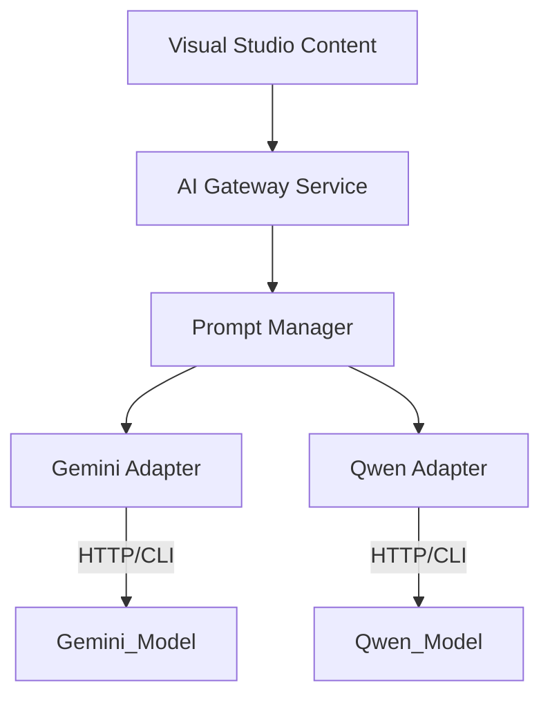

# AI Engine Integration (Gemini / Qwen)

This document outlines the strategy for integrating GenAI models (specifically Gemini and Qwen) to "supercharge" the development lifecycle within the Low-Code Platform.

## 1. Architecture: The AI Gateway

To avoid vendor lock-in and handle different models (Gemini for reasoning, Qwen for coding/efficiency), we introduce an **AI Gateway Layer** in the Platform API.



### 1.1 The Abstraction
We define a standard interface `IAiAssistant`:
```csharp
public interface IAiAssistant {
    Task<string> GenerateJsonAsync(string prompt, string schemaDefinition);
    Task<string> SuggestMappingAsync(string sourceFields, string targetFields);
    Task<string> ExplainErrorAsync(string logs);
}
```

## 2. Feature 1: "Text-to-App" (Scaffolding)

**User Action**: In the "New Project" modal, the user types: *"I need a Vehicle Maintenance application. We track Trucks, Drivers, and MaintenanceLogs (date, cost, description)."*

**Process**:
1.  **Prompting**: The Gateway constructs a prompt explaining our **Metadata JSON Schema**.
    *   *System Prompt*: "You are an architect. Output ONLY valid JSON matching this schema: [EntitySchema]. Create entities for..."
2.  **Model Selection**: We use **Gemini Pro** (High reasoning) for this tasks.
3.  **Validation**: The Engine attempts to deserialize the AI response. If invalid, it auto-repairs or retries.
4.  **Result**: The user sees the Entity Diagram pre-populated. They can then manually refine it.

## 3. Feature 2: Smart Schema Mapping (The "Auto-Weaver")

**User Action**: In the Schema Mapper (API Integration), the user has a source with 50 fields and a target with 50 fields.

**Process**:
1.  **Payload**: We send the list of Source Field Names and Target Field Names to **Qwen-72B** (Great at coding/pattern matching).
2.  **Prompt**: "Map these source fields to target fields based on semantic similarity. formatting: JSON Dictionary."
    *   *Match*: `src.fname` -> `tgt.FirstName`
    *   *Match*: `src.mobile_no` -> `tgt.PhoneNumber`
3.  **UI Interaction**: The Mapper UI draws "Ghost Lines" (dotted) for predictions. User clicks "Confirm All".

## 4. Feature 3: Logic & Expression Copilot

**User Action**: In the Business Rules Logic Builder, the user needs a Regex for a specific invoice format but doesn't know Regex.

**Process**:
1.  **Input**: "Format must be INV- followed by 4 digits, then a dash, then two letters."
2.  **Model**: **Qwen-Coder** or **Gemini**.
3.  **Output**: `^INV-\d{4}-[A-Z]{2}$`
4.  **Integration**: The platform automatically pastes this into the "Regex Pattern" property of the Validator.

## 5. Feature 4: Workflow Generation

**User Action**: "Create an approval workflow where requests over $500 go to the Manager, otherwise auto-approve."

**Process**:
1.  **Prompt**: Explain the JSON Schema for the Workflow Engine (Steps, Transitions).
2.  **Output**: A JSON array of steps:
    *   Step 1: `Decision` ("Amount > 500").
    *   Step 1 (True) -> Step 2: `UserTask` ("Manager Approval").
    *   Step 1 (False) -> Step 3: `SetStatus` ("Approved").

## 6. Technical Implementation: CLI Integration

If using local CLIs (e.g., for self-hosted Qwen via `llama.cpp` or official CLI tools), the backend creates a **Process Wrapper**.

**Service: `ShellAiProvider.cs`**
```csharp
public class ShellAiProvider : IAiAssistant {
    private readonly string _executablePath; // e.g., "qwen-cli"

    public async Task<string> PromptAsync(string prompt) {
        var processStartInfo = new ProcessStartInfo {
            FileName = _executablePath,
            Arguments = $"-p \"{Escape(prompt)}\" --json", // Hypothetical flags
            RedirectStandardOutput = true,
            UseShellExecute = false
        };
        
        using var process = Process.Start(processStartInfo);
        string output = await process.StandardOutput.ReadToEndAsync();
        return ExtractJson(output);
    }
}
```

*Note: For production scalability, we strongly recommend wrapping the CLI in a Python FastAPI Microservice specifically for serving the model, rather than shelling out from ASP.NET Core threads.*

## 7. The "Self-Healing" Mechanism (Runtime)

**Scenario**: A generated SQL query fails because of a missing column (drift).
1.  **Log Analysis**: The runtime catches the `SqlException`.
2.  **AI Analysis**: Sends the Exception + Schema to Gemini.
3.  **Suggestion**: Gemini suggests: "The column `IsActive` was renamed to `Status`. Update the metadata View definition."
4.  **Admin Dashboard**: Alerts the administrator with the "Fix It" button.
