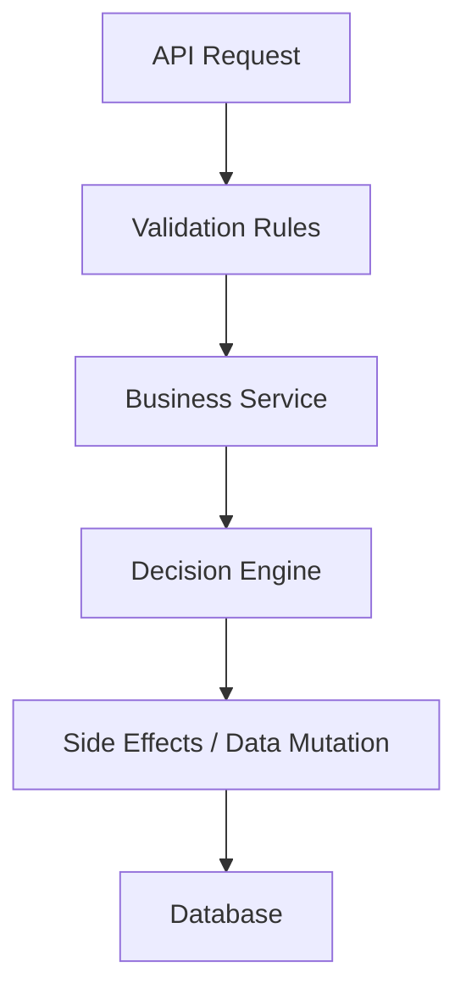

# Business Rules Engine Strategy

To prevent "Spaghetti Code" where business logic is scattered across Controllers, Services, and UI, we will implement a dedicated **Declarative Rules Engine**. All business logic will be defined visually and centralized.

## 1. Architecture: The "Decision Layer"

We will treat Business Rules as a first-class citizen, separating **Data** (Entities) from **Logic** (Rules).



## 2. Rule Definition (The Metadata)

Rules are stored in JSON format, allowing them to be versioned and structured.

**Structure of a Rule:**
*   **Context**: Which Entity/Event does this apply to? (e.g., `Order`)
*   **Trigger**: When does it run? (`OnCreate`, `OnUpdate`, `OnStatusChange`)
*   **Condition**: A logical expression (e.g., `Order.Total > 1000 AND User.IsVIP == false`)
*   **Actions**: What happens? (`SetField`, `ThrowError`, `TriggerWorkflow`)

### Example JSON Rule
```json
{
  "ruleId": "r_101",
  "name": "HighValueOrderValidation",
  "context": "Order",
  "trigger": "OnBeforeCreate",
  "expression": "TotalAmount > 10000 && Customer.CreditScore < 700",
  "actions": [
    {
      "type": "Reject",
      "message": "Credit check required for orders over 10k"
    }
  ]
}
```

## 3. The Visual UI (Logic Builder)

We will implement a **Block-Based Builder** or **Predicate Builder** in the Studio.

### UI Components
1.  **Expression Builder**:
    *   Dropdowns for Fields (Context-aware, e.g., shows `Order.Total`).
    *   Operators (`Greater Than`, `Contains`, `Matches Regex`).
    *   Inputs (Static values or other Fields).
2.  **Action Configurator**:
    *   "Set [Status] to ['Pending Approval']"
    *   "Send Email to [Manager]"

*Technology*: Use a library like `React Query Builder` (ported to Angular) or a custom recursive logic component.

## 4. Execution Strategy: Code Generation (Not Interpretation)

To maintain high performance and type safety, we will **Transpile** these JSON rules into C# code (Specification Pattern + FluentValidation) rather than interpreting them at runtime.

### 4.1. Validation Rules -> FluentValidation
Simple rules (Required, Range, Regex) are compiled into FluentValidation classes.

**Generated Code:**
```csharp
public class OrderValidator : AbstractValidator<Order> {
    public OrderValidator() {
        RuleFor(x => x.TotalAmount)
            .LessThan(10000)
            .When(x => x.Customer.CreditScore < 700)
            .WithMessage("Credit check required...");
    }
}
```

### 4.2. Business Logic -> Domain Services
Complex rules (Setting values, cascading updates) are generated into `DomainServices`.

**Generated Code (`OrderLogic.Generated.cs`):**
```csharp
public partial class OrderLogic {
    public void ApplyOnCreateRules(Order order) {
        // Reg. ID: r_102 (Auto-Discount)
        if (order.Items.Count > 10) {
            order.Discount = 0.15m;
        }
    }
}
```

## 5. Advanced: Microsoft "RulesEngine" Integration

For scenarios where rules need to change *without* redeploying the code (Hot-Swapping), we can integrate the `Microsoft.RulesEngine` NuGet package.

*   **Use Case**: Tax Rates, Dynamic Scoring, Eligibility.
*   **Implementation**:
    1.  The generated app includes a `Rules.json` file.
    2.  A generic `RuleService` loads this JSON on startup.
    3.  `Evaluate(entity, workflowName)` is called.

This allows the UI to update the JSON in the database, and the running app picks up the change instantly (via a cache refresh).

## 6. Avoiding "Spaghetti"

By enforcing this structure:
1.  **Centralization**: All rules are visible in the specific "Logic" tab of the Entity.
2.  **Immutability**: Developers cannot "hack" `if` statements into random Controllers; they must create a Rule or writing a Domain Service.
3.  **Traceability**: Every rule has an ID. We can log "Rule X fired" in the audit trail.
