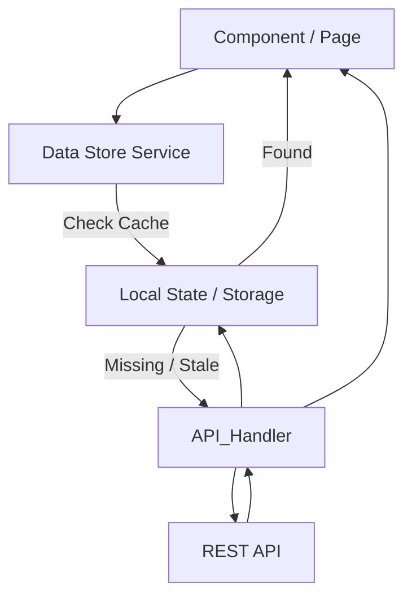

# Client-Side Data Caching & Store Strategy

To maximize performance and reduce API chatter, the platform provides a configurable **Client Data Store**. This allows "Core Data" (Master Data, Lookups, User Profile) to be cached locally and managed declaratively.

## 1. High-Level Architecture

We inject a **Caching Layer** between the UI Components and the API Client.



## 2. Configurable Caching Metadata

Users can designate specific Entities or Data Sources as "Cacheable" within the **Entity Designer** or **Variable Designer**.

### 2.1 Entity Configuration
When defining an Entity (e.g., `Country`), the user sees a "Performance" tab.

*   **Cache Scope**: 
    *   `None` (Always fetch fresh)
    *   `Session` (Memory only, lost on refresh)
    *   `Persistent` (LocalStorage/IndexedDB, survives refresh)
*   **Invalidation Policy (TTL)**:
    *   `Never` (Static dictionaries)
    *   `Time Based` (e.g., "Expire after 1 hour")
    *   `On Change` (Invalidate if I perform an Update/Delete)

### 2.2 Metadata JSON Structure
```json
{
  "entityId": "e_country",
  "name": "Country",
  "caching": {
    "enabled": true,
    "scope": "Persistent", // LocalStorage
    "ttlMinutes": 1440,    // 24 Hours
    "syncStrategy": "Lazy" // Fetch on first access
  }
}
```

## 3. The "Global Store" Designer

There will be a specialized "Global Data" section in the Studio to design this "Core Data".

**Features:**
1.  **Define Collections**: "I want a global list of `Currencies` available everywhere."
2.  **Define Prefetch**: "Load `UserPermissions` immediately when the App starts (AppInitializer)."
3.  **Define Keys**: "Group `Cities` by `RegionId`."

## 4. Code Generation Strategy (NgRx / ELF)

The platform generates a **Type-Safe Store Service** wrapping a state management library (like ELF or a lightweight custom solution over RxJS).

### 4.1. The Generated Service
**File: `src/app/core/stores/country.store.ts`**

```typescript
@Injectable({ providedIn: 'root' })
export class CountryStoreService {
    
    // The BehaviorSubject holds the data in memory
    private cache$ = new BehaviorSubject<Country[] | null>(null);
    private lastFetch: number = 0;

    constructor(private api: ApiService, private storage: LocalStorageService) {
        // Hydrate from LocalStorage on boot if Persistent
        const saved = this.storage.get('cache_countries');
        if (saved) {
             this.cache$.next(saved.data);
             this.lastFetch = saved.timestamp;
        }
    }

    // The Main Accessor
    getAll(): Observable<Country[]> {
        if (this.shouldFetch()) {
            return this.refresh();
        }
        // Return cached version
        return this.cache$.asObservable().pipe(filter(x => !!x));
    }

    private shouldFetch(): boolean {
        const now = Date.now();
        // Check 1: Is it empty?
        if (!this.cache$.getValue()) return true;
        // Check 2: Expired? (TTL defined in metadata)
        if ((now - this.lastFetch) > (1440 * 60 * 1000)) return true;
        
        return false;
    }

    // Fetch from API and Update Store
    refresh(): Observable<Country[]> {
        return this.api.getCountries().pipe(
            tap(data => {
                this.cache$.next(data);
                this.lastFetch = Date.now();
                // Persist to LocalStorage
                this.storage.set('cache_countries', { data, timestamp: this.lastFetch });
            })
        );
    }
}
```

### 4.2. Usage in Components
Developers use the Store Service exactly like an API Service, unaware of the complexity.

```typescript
// The component asks for data, doesn't care if it's from API or RAM
this.countryStore.getAll().subscribe(c => this.countries = c);
```

## 5. Advanced: Invalidation Logic

What happens if we Add a new Country?

**Metadata**: `InvalidateOnWrite: true`

**Generated Mutation Code:**
```typescript
createCountry(c: CountryDto) {
    return this.api.createCountry(c).pipe(
        tap(() => {
            // Optimistic Update OR Invalidate
            this.cache$.next([...this.cache$.value, c]); 
            // OR simple invalidation to force refetch next time
            // this.lastFetch = 0; 
        })
    );
}
```

## 6. Security Considerations

**Warning**: We do **not** cache sensitive data (PII, Financials) in LocalStorage by default.
*   **Encrypted Storage**: If "Persistent" is selected for sensitive entities, the code generator wraps the storage calls with a crypto-js layer using a session key.
