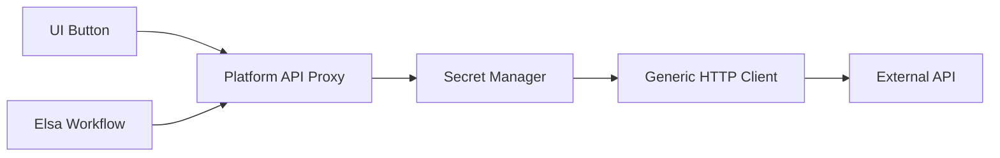

# External API Integration Hub Architecture

This document outlines the design for the **Integration Hub**, a module enabling the platform to consume external REST/SOAP services via configuration using a "No-Code" connector approach.

## 1. Core Concept: "Connectors" as Metadata

Instead of writing `HttpClient` code, users define **Connectors**. A Connector represents an external system (e.g., "Salesforce", "Stripe", "Legacy ERP").

### 1.1 Structural Hierarchy
1.  **Connector (System)**: Holds Base URL and Authentication logic.
    *   *Example: Stripe API (`https://api.stripe.com`)*
2.  **Endpoint (Action)**: Represents a specific operation.
    *   *Example: Create Customer (`POST /v1/customers`)*

## 2. Metadata Schema

Stored in `Artifacts` table.

### 2.1 Connector Schema
```json
{
  "connectorId": "conn_stripe_01",
  "name": "Stripe Payments",
  "baseUrl": "https://api.stripe.com/v1",
  "auth": {
    "type": "Bearer", 
    "tokenLocation": "Header", // Header | Query | Body
    "key": "Authorization",
    "encryptedSecretId": "sec_stripe_key_dev" // Reference to Secure Vault
  },
  "headers": [
     { "key": "Content-Type", "value": "application/x-www-form-urlencoded" }
  ]
}
```

### 2.2 Endpoint Schema (The "Operation")
```json
{
  "endpointId": "ep_create_customer",
  "connectorId": "conn_stripe_01",
  "method": "POST",
  "path": "/customers",
  "inputs": [
    { "name": "email", "type": "string", "required": true },
    { "name": "name", "type": "string" }
  ],
  "bodyTemplate": "email={{email}}&name={{name}}", // Handlebars / Liquid template
  "responseMap": {
    "customerId": "id",     // Map JSON response 'id' to output 'customerId'
    "status": "subscriptions.data[0].status"
  }
}
```

## 3. The Runtime Engine (Integration Service)

We do not generate custom C# code for each API. Instead, we generate a **Proxy Call** to a generic **Integration Runtime**.

### 3.1 Architecture


### 3.2 The `IntegrationExecutor` Service
This core C# service accepts a configuration and payload, matches them, and executes the request.

```csharp
public class IntegrationExecutor {
    public async Task<JsonNode> ExecuteAsync(string endpointId, Dictionary<string, object> inputs) {
        // 1. Load Metadata
        var endpoint = _repo.GetEndpoint(endpointId);
        var connector = _repo.GetConnector(endpoint.ConnectorId);

        // 2. Resolve Secrets
        var token = _vault.GetSecret(connector.Auth.EncryptedSecretId);

        // 3. Build Request
        var request = new HttpRequestMessage(endpoint.Method, connector.BaseUrl + endpoint.Path);
        request.Headers.Add("Authorization", $"Bearer {token}");
        
        // 4. Render Body (Using Scriban/Handlebars)
        string body = _renderer.Render(endpoint.BodyTemplate, inputs);
        request.Content = new StringContent(body, Encoding.UTF8, "application/json");

        // 5. Send
        var response = await _httpClient.SendAsync(request);
        
        // 6. Map Output
        return _mapper.Map(response.Content, endpoint.ResponseMap);
    }
}
```

## 4. Integration Points

### 4.1 In Forms (Button Action)
In the Interaction Designer:
*   **Action Type**: `Execute Integration`.
*   **Select Integration**: "Stripe - Create Customer".
*   **Map Inputs**:
    *   `email`: Binds to `model.customerEmail`.
    *   `name`: Binds to `model.fullName`.

**Generated Code**:
```typescript
async onBtnClick() {
    // Calls the Platform Proxy, not Stripe directly (Avoids CORS/Secret exposure)
    await this.api.executeIntegration('ep_create_customer', { 
        email: this.model.customerEmail,
        name: this.model.fullName 
    });
}
```

### 4.2 In Workflows (Elsa Step)
A custom Elsa Activity `ExecuteExternalApi` is registered.
*   **Input**: Dropdown listing all defined Endpoints.
*   **Parameters**: Auto-generated inputs based on the Endpoint definition.

## 5. Security Vault (Secret Management)

**CRITICAL**: We never store API keys in plain text JSON metadata.
*   **Secure Storage**: Use Azure Key Vault or Encrypted SQL Column (AES-256).
*   **Reference**: JSON only stores the `KeyID` (e.g., `sec_stripe_key_dev`).
*   **Runtime**: The `IntegrationExecutor` is the *only* component allowed to decrypt.

## 6. Advanced Features

*   **Mocking**: Toggle a "Mock Mode" on the Connector to return static JSON instead of calling the real API (for dev/testing).
*   **Throttling**: Configurable Rate Limiting (e.g., "Max 100 calls/minute") to prevent overwhelming legacy systems.
*   **Logging**: Full Request/Response logging in a specialized "Integration Log" table for debugging.

