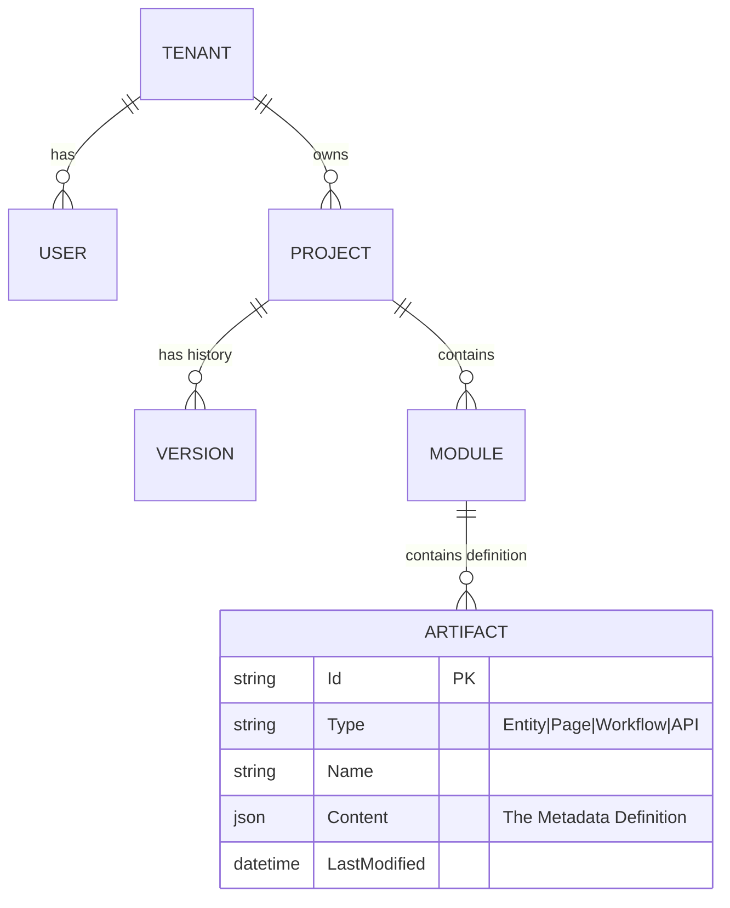

# Platform Database Schema Design

This database stores the *definitions* of applications built on the platform. It does NOT store the runtime data of the generated applications.

**Database Engine**: Azure SQL Database (supporting JSON columns).

## 1. Entity Relationship Diagram (Conceptual)



## 2. Table Definitions

### 2.1 Tenants
Multi-tenancy root.
| Column | Type | Notes |
|--------|------|-------|
| Id | GUID | PK |
| Name | NVARCHAR(200) | |
| LicenseTier | NVARCHAR(50) | Free, Pro, Enterprise |

### 2.2 Projects
Represents an "Application" being built.
| Column | Type | Notes |
|--------|------|-------|
| Id | GUID | PK |
| TenantId | GUID | FK -> Tenants |
| Name | NVARCHAR(100) | |
| Description | NVARCHAR(MAX) | |
| CreatedBy | GUID | FK -> User |
| CurrentVersion | NVARCHAR(20) | e.g. "1.0.4" |

### 2.3 Modules
Logical grouping within an app (e.g., "Core", "HR_Management").
| Column | Type | Notes |
|--------|------|-------|
| Id | GUID | PK |
| ProjectId | GUID | FK -> Projects |
| Name | NVARCHAR(100) | |

### 2.4 Artifacts
The core table. Stores the actual low-code definitions.
| Column | Type | Notes |
|--------|------|-------|
| Id | GUID | PK |
| ModuleId | GUID | FK -> Modules |
| ArtifactType | INT | 1=Entity, 2=Page, 3=Workflow, 4=Script |
| Name | NVARCHAR(200) | Unique within Module |
| Content | NVARCHAR(MAX) | **JSON** - The specific schema for the entity/page |
| LockedBy | GUID | NULL if free. User ID if being edited. |
| LastUpdated | DATETIME | |

### 2.5 Versions (Snapshots)
Immutable history of valid builds.
| Column | Type | Notes |
|--------|------|-------|
| Id | GUID | PK |
| ProjectId | GUID | FK -> Projects |
| VersionNumber | NVARCHAR(20) | |
| SnapshotBlobUrl | NVARCHAR(500) | URL to Blob Storage containing full export |
| CommittedBy | GUID | |
| CommittedAt | DATETIME | |

## 3. Metadata JSON Structures (Stored in `Artifacts.Content`)

### Entity Artifact
```json
{
  "tableName": "Employee",
  "persistence": "SQL",
  "fields": [
    {"name": "FirstName", "type": "String", "length": 50},
    {"name": "BirthDate", "type": "DateTime"}
  ],
  "indexes": []
}
```

### Page Artifact
```json
{
  "layout": "DashboardLayout",
  "route": "/employees/:id",
  "widgets": [
    {
      "type": "Form",
      "dataSource": "GetEmployeeById",
      "fields": [...]
    }
  ]
}
```

## 4. Query Patterns

- **Load Project**: `SELECT * FROM Artifacts WHERE ProjectId = @ID`.
- **Search**: `SELECT Name, Type FROM Artifacts WHERE Content LIKE '%searchTerm%'` (Using JSON functions).
- **Locking**: `UPDATE Artifacts SET LockedBy = @User WHERE Id = @Id AND LockedBy IS NULL`.
