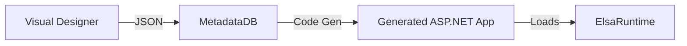

# Workflow Engine Integration Strategy

The platform supports defining business processes visually. We will integrate **Elsa Workflows** (an open-source .NET Core workflow engine) rather than building a custom engine.

## 1. Architecture

We embed the Elsa Engine into the **Generated Application**, not just the Platform.
*   **Platform Studio**: Defines the workflow (JSON serialization matches Elsa's JSON format).
*   **Generated App**: Includes `Elsa.Core` and `Elsa.Server.Api` NuGet packages.

## 2. Metadata Translation

The Studio's "Workflow JSON" must be transformed into "Elsa Workflow Definitions" during code generation or runtime startup.

**Strategy: Runtime Loading**
Instead of generating C# code for workflows, the generated app will have a `WorkflowLoaderService`.
1.  App Startup -> `WorkflowLoaderService` fetches Workflow JSON from the Metadata Store.
2.  Converts internal JSON -> Elsa `WorkflowDefinition`.
3.  Registers it with the `IWorkflowDefinitionStore`.

## 3. Custom Activities

The Low-Code platform exposes specific "Activities" that map to the App's Entities.
*   `CreateEntityActivity`
*   `SendEmailActivity`
*   `ApprovalTaskActivity`

**Code Generation aspect**:
The generator must create a generic wrapper for the App's Entities so Elsa can talk to them.
- `Create<T>Activity`: A generic activity where T is determined at runtime or specific wrappers like `CreateCustomerActivity` are generated.

## 4. Persistence

Elsa requires its own database tables (`ElsaWorkflowDefinitions`, `ElsaWorkflowInstances`).
- **Development**: Use SQLite or the App's SQL DB (Schema separation).
- **Production**: Dedicated SQL Schema.

## 5. Execution Model

- **Triggering**:
    - **API**: `POST /api/workflows/{workflowId}/execute`
    - **Event**: `OnEntityCreated("Customer")`. The generated `CustomerService` will publish an event (MediatR). A `WorkflowNotificationHandler` listens and triggers the matching Elsa workflow.

## 6. User Tasks (Long Running)

For "Approval" steps:
1.  Workflow halts at `UserTaskActivity`.
2.  Creates a record in `UserMethodTask` table (Custom table in Generated App).
3.  UI shows "My Tasks".
4.  User clicks "Approve" -> Calls API -> Resumes Elsa Workflow.
